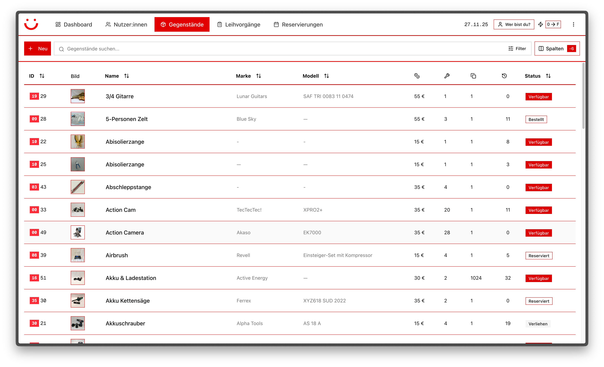

# leih.lokal Verwaltung



Modern library management system built with Next.js 15, React 19, and PocketBase.

## Tech Stack

- **Frontend**: Next.js 15 (App Router), React 19, TypeScript
- **UI**: Shadcn/ui + Tailwind CSS
- **Backend**: PocketBase
- **PWA**: next-pwa
- **Forms**: React Hook Form + Zod
- **Charts**: Recharts
- **Testing**: Vitest + Playwright

## Getting Started

### Prerequisites

- Node.js 20+ and npm
- PocketBase instance running (see [PocketBase Setup](#pocketbase-setup))

### Installation

1. **Clone the repository**

```bash
git clone <repository-url>
cd llka-verwaltung
```

2. **Install dependencies**

```bash
npm install
```

3. **Configure environment variables**

```bash
cp .env.local.example .env.local
```

Edit `.env.local` and set your PocketBase URL:

```env
NEXT_PUBLIC_POCKETBASE_URL=http://localhost:8090
```

4. **Run the development server**

```bash
npm run dev
```

Open [http://localhost:3000](http://localhost:3000) in your browser.

### PocketBase Setup

1. **Download PocketBase** from [pocketbase.io](https://pocketbase.io/docs/)

2. **Run PocketBase**

```bash
./pocketbase serve
```

PocketBase will run on `http://localhost:8090` by default.

3. **Create admin account**

- Open `http://localhost:8090/_/` in your browser
- Create your admin account

4. **Login to the app**

- Open the app at `http://localhost:3000`
- You'll see the login page with three fields:
  - **PocketBase Server-URL**: Enter your PocketBase URL (e.g., `http://localhost:8090`)
  - **Benutzername**: Your admin email
  - **Passwort**: Your admin password
- The server URL is stored in your browser and remembered for future logins

5. **Import database schema** (coming soon)

The PocketBase collections will be automatically created when you use the app, or you can manually import the schema from `pocketbase_schema.json`.

## Deployment
### Self-hosted
To build and deploy as an SPA under a subpath, run:

```bash
BASE_PATH=/backend NEXT_PUBLIC_POCKETBASE_URL=https://leihlokal-ka.de npm run build
```

Then, serve `out/` as static files.

## Project Structure

```
/app
  (auth)/login          # Authentication
  (dashboard)           # Main app pages
    /dashboard          # Dashboard home
    /customers          # Customer management
    /items              # Item management
    /rentals            # Rental management
    /reservations       # Reservation management
    /settings           # App settings
    /logs               # Application logs
/components
  /ui                   # Shadcn UI components
  /layout               # Navigation components
/lib
  /pocketbase           # PocketBase client & auth
  /constants            # App constants
  /utils                # Utility functions
/hooks                  # Custom React hooks
/types                  # TypeScript type definitions
```

## Available Scripts

- `npm run dev` - Start development server
- `npm run build` - Build for production
- `npm start` - Start production server
- `npm run lint` - Run ESLint
- `npm run lint:fix` - Fix ESLint errors
- `npm run type-check` - Run TypeScript compiler check
- `npm run test` - Run unit tests
- `npm run test:e2e` - Run E2E tests

## Development Guidelines

### Code Style

- Use TypeScript strict mode
- Follow existing naming conventions
- Add JSDoc comments for public APIs
- Use functional components with hooks
- Prefer Server Components when possible

### Component Structure

```tsx
/**
 * Component description
 */

'use client'; // Only if client component

import { ... } from '...';

interface ComponentProps {
  // Props with JSDoc
}

export function Component({ ...props }: ComponentProps) {
  // Component logic
}
```

### Imports

Use path aliases for clean imports:

```tsx
import { Customer } from '@/types';
import { pb } from '@/lib/pocketbase/client';
import { Button } from '@/components/ui/button';
import { formatDate } from '@/lib/utils/formatting';
```

## Contributing

1. Create a feature branch
2. Make your changes
3. Run type check: `npm run type-check`
4. Run linter: `npm run lint:fix`
5. Commit and push
6. Create a pull request

## License

[Add license information]

## Support

For issues and questions, please open an issue on GitHub.
