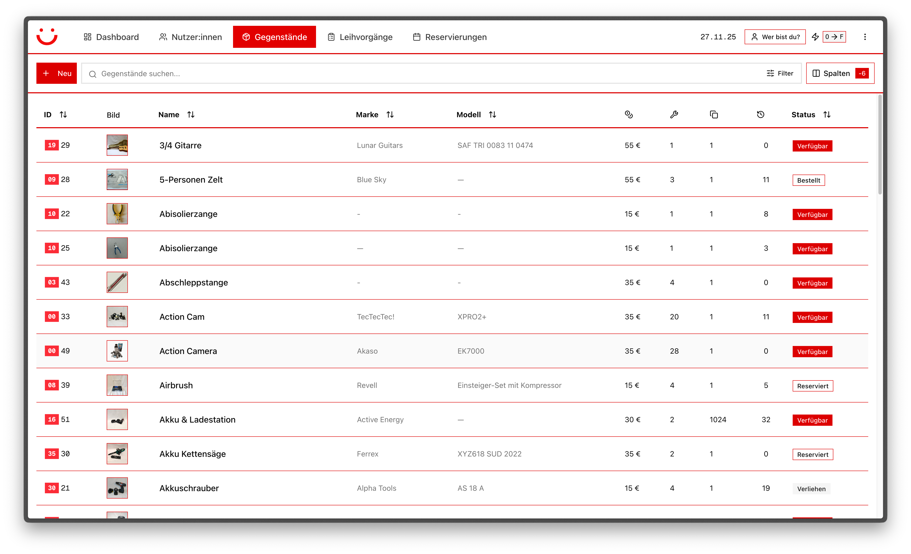

# leih.lokal Verwaltung



Staff front-end for the leih.lokal lending library (customers, items, rentals, reservations, bookings), built with Next.js 16, React 19, and PocketBase.

## Tech Stack

- **Frontend**: Next.js 16 (App Router, static export), React 19, TypeScript
- **UI**: Shadcn/ui + Tailwind CSS 4
- **Backend**: PocketBase 0.26 ([leihbackend](https://github.com/leih-lokal/leihbackend))
- **Forms**: React Hook Form + Zod
- **Charts**: Recharts
- **Testing**: Vitest (unit tests)

## Getting Started

### Prerequisites

- Node.js 20.9+ (24 recommended, as in the Docker image) and npm
- PocketBase instance running (see [PocketBase Setup](#pocketbase-setup))

### Installation

1. **Clone the repository**

```bash
git clone <repository-url>
cd llka-verwaltung
```

2. **Install dependencies**

```bash
npm install
```

3. **Optional: default server URL**

The PocketBase URL is entered on the login page and remembered in the browser. To change the prefilled value, create `.env.local`:

```env
NEXT_PUBLIC_POCKETBASE_URL=http://localhost:8090
```

4. **Run the development server**

```bash
npm run dev
```

Open [http://localhost:3000](http://localhost:3000) in your browser.

### PocketBase Setup

1. **Run the backend.** The collections, API rules and hooks live in [leihbackend](https://github.com/leih-lokal/leihbackend) (PocketBase with migrations); follow its README, or use its Docker image (see [DOCKER.md](DOCKER.md#docker-compose-example)).

PocketBase runs on `http://localhost:8090` by default.

2. **Create a superuser account**

- Open `http://localhost:8090/_/` in your browser
- Create a superuser account. The app signs in against PocketBase's `_superusers` collection.

3. **Log in to the app**

- Open the app at `http://localhost:3000`
- You'll see the login page with three fields:
  - **PocketBase Server-URL**: Enter your PocketBase URL (e.g., `http://localhost:8090`)
  - **Benutzername**: Your admin email
  - **Passwort**: Your admin password
- The server URL is stored in your browser and remembered after a successful login

## Deployment

### Static files
`npm run build` produces a static export in `out/`. To deploy under a subpath:

```bash
BASE_PATH=/backend NEXT_PUBLIC_POCKETBASE_URL=https://leihlokal-ka.de npm run build
```

Then serve `out/` with any static file server. Pushes to `main` are deployed to GitHub Pages this way (`.github/workflows/nextjs.yml`).

### Docker
See [DOCKER.md](DOCKER.md). The image uses Next.js standalone output.

## Project Structure

```
/app
  (auth)/login          # Login (server URL + credentials)
  (dashboard)           # Main app pages
    /dashboard          # Dashboard home
    /customers          # Customers
    /items              # Items (+ /items/analytics)
    /rentals            # Rentals
    /reservations       # Reservations
    /bookings           # Booking calendar
    /overdue            # Overdue rentals
    /label-designer     # Item label printing
    /system-check       # Check active rentals against what is physically on hand
    /settings           # Branding, appearance, features, opening hours
    /setup              # First-run setup
    /logs               # PocketBase request logs
/components             # Feature components (+ /ui for Shadcn primitives)
/lib
  /pocketbase           # PocketBase client & auth
  /filters, /tables     # Filter and column configs for the list pages
  /constants            # Labels, statuses, help texts
  /utils                # Formatting, availability, rental templates, …
/hooks                  # Custom React hooks
/types                  # TypeScript type definitions
```

## Available Scripts

- `npm run dev` - Start development server
- `npm run build` - Build for production (static export in `out/`)
- `npm run lint` - Run ESLint
- `npm run lint:fix` - Fix ESLint errors
- `npm run type-check` - Run TypeScript compiler check
- `npm run test` - Run unit tests (Vitest, watch mode; `npx vitest run` for a single run)

## Settings

The settings page (Konfiguration) includes four tabs:

- **Branding** — App name, logo, favicon, copyright
- **Darstellung** — Primary color, ID format
- **Funktionen** — Feature toggles (e.g. reservations)
- **Öffnungszeiten** — Opening hours per weekday

Settings are stored in a PocketBase `settings` singleton collection. If the collection doesn't exist yet, the settings page offers to create it automatically.

Opening hours configured here are used by leihbackend for reservation pickup validation and are also available via leihbackend's public `GET /api/opening-hours` endpoint.

## Development Guidelines

### Code Style

- Use TypeScript strict mode
- Follow existing naming conventions
- Add JSDoc comments for public APIs
- Use functional components with hooks
- Pages are client components: the PocketBase URL is chosen per browser at login, so data is fetched client-side

### Component Structure

```tsx
/**
 * Component description
 */

'use client'; // Only if client component

import { ... } from '...';

interface ComponentProps {
  // Props with JSDoc
}

export function Component({ ...props }: ComponentProps) {
  // Component logic
}
```

### Imports

Use path aliases for clean imports:

```tsx
import { Customer } from '@/types';
import { pb } from '@/lib/pocketbase/client';
import { Button } from '@/components/ui/button';
import { formatDate } from '@/lib/utils/formatting';
```

## Contributing

1. Create a feature branch
2. Make your changes
3. Run type check: `npm run type-check`
4. Run tests: `npx vitest run`
5. Run linter: `npm run lint:fix`
6. Commit and push
7. Create a pull request

## License

[Add license information]

## Support

For issues and questions, please open an issue on GitHub.
